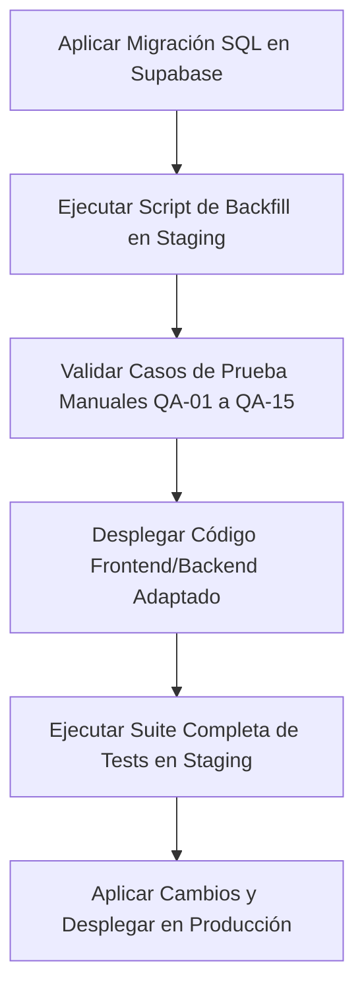

# Plan de Arquitectura y Pruebas Senior: Culto de Enseñanza Dominical a las 17:00

**Fecha del Plan:** 2026-05-25  
**Fecha de Inicio de Backfill:** Domingo 31 de mayo de 2026 (inclusive)  
**Objetivo:** Añadir un segundo culto dominical de Enseñanza a las **17:00** en el sistema, conviviendo con el culto matutino tradicional de las **10:00**, permitiendo asignaciones, lecturas y gestiones independientes, y desactivando las secuencias de autocompletado de himnos/coros que ya no se usan.

---

## 1. Resumen Ejecutivo y Decisiones de Producto

Tras consultar las especificaciones con el equipo de producto, se establecen las siguientes bases de diseño:

1. **Eliminación del Autofill:** La secuencia automática de himnos y coros para los cultos de Alabanza y Enseñanza **se elimina por completo** del sistema debido a desuso. Esto simplifica la base de código y elimina las complejas lógicas de punteros incrementales entre cultos de una misma semana.
2. **Backfill del Histórico:** Se generarán los cultos vespertinos de las 17:00 a partir del **domingo 31 de mayo de 2026** hacia adelante. Todos los cultos de las 17:00 generados se inicializarán **vacíos** (sin asignaciones de hermanos, lecturas ni himnos/coros).
3. **Mismo Tipo de Culto con Etiquetas de Hora:** El culto de la tarde mantendrá el tipo de culto **Enseñanza** (mismo color, mismas instrucciones por rol, misma plantilla de disponibilidad). Para diferenciarlos en vistas agregadas (calendarios, mis asignaciones), se mostrarán sufijos horarios explícitos (`10h` / `17h`).
4. **Lógica de Dashboard Adaptativa:** El componente principal del Dashboard mostrará dinámicamente el culto que corresponda:
   - **Antes de las 10:00:** Muestra el de las 10:00.
   - **De 10:00 a 17:00:** Muestra el de las 17:00 (o si el de las 10:00 está completado).
   - **Después de las 17:00:** Muestra el de las 17:00 hasta el cambio de día.
5. **Independencia en Cambios y Festivos:** Toda modificación horaria, de estado o de festivo laborable afectará de manera **individual y aislada** al culto donde se ejecute, sin alterar al otro culto del domingo.
6. **Disponibilidad Compartida:** Se mantiene un único perfil de disponibilidad general para el domingo. Si un hermano está disponible el domingo, es elegible para asignaciones en cualquiera de los dos cultos (10h y 17h).

---

## 2. Estado del Arte vs Nueva Arquitectura

### 2.1 Base de Datos (`culto_schedules`)
- **Antes:** Un UNIQUE constraint sobre `day_of_week` impedía guardar más de un horario base por día de la semana.
- **Ahora:** Se modifica el UNIQUE constraint para que sea compuesto: `(day_of_week, default_time)`. Esto permite registrar una regla para el domingo a las `10:00:00` y otra para el domingo a las `17:00:00`.

### 2.2 Generación de Cultos (`actions.ts`)
- **Antes:** Se agrupaban los horarios en un `Map` por `day_of_week`, asumiendo una única fila por día de la semana.
- **Ahora:** Se agruparán en un array de horarios por día (`Map<number, CultoSched[]>`), generando un bucle interno que inserte un registro en la tabla `cultos` por cada horario programado para ese día.

### 2.3 Calendario (`Calendar.tsx`)
- **Antes:** El componente eliminaba duplicados por fecha guardando los cultos en un `Map` por `fecha` (`eventsMap.set(e.fecha, e)`).
- **Ahora:** El calendario soportará renderizar múltiples cultos en un mismo día. La vista desktop mostrará mini-bloques independientes dentro de la misma celda ordenados por hora, y la vista móvil listará todos los cultos del día de forma secuencial. Se añadirá el distintivo de hora (`10h` y `17h`) para clarificar la visualización.

---

## 3. Mapa de Impacto de Software (QA)

| Módulo / Capa | Nivel de Riesgo | Impacto Técnico | Mitigación |
|---|---|---|---|
| **Base de Datos** | 🟠 Alto | Modificación de restricciones UNIQUE en `culto_schedules` y actualización de índices. | Migración SQL segura y robusta que compruebe preexistencias. |
| **Generador de Cultos** | 🔴 Crítico | Código de bucles en backend asume un culto diario máximo. | Reescribir lógica a estructura multiesquema (`schedules[]`). |
| **Calendario (Grid & List)** | 🔴 Crítico | Deduplicación de eventos por fecha en renderizado. | Permitir renderizar múltiples elementos por día ordenados cronológicamente. |
| **Dashboard Client** | 🟠 Alto | Query `limit(1)` por fecha para cargar el "culto de hoy". | Adaptar query a `order('hora_inicio', { ascending: true })` y lógica horaria adaptativa. |
| **Mis Asignaciones Panel** | 🟡 Medio | Falta de indicador de hora en las tarjetas de asignaciones. | Añadir la hora de inicio en el badge de fecha de cada asignación. |
| **Historial de Lecturas** | 🟡 Medio | Mismo tipo de culto causa confusión visual sobre qué domingo fue. | Añadir `hora_inicio` en el listado y filtro de lecturas. |
| **Secuencias (Autofill)** | 🔴 Crítico | Código residual que intenta autogenerar himnos/coros de Enseñanza. | Deprecar/eliminar el cron-job de autofill de secuencias y eliminar los tests obsoletos. |
| **Gestión de Festivos** | 🟡 Medio | Cambiar a festivo un culto no debe alterar el horario del otro. | Asegurar que la lógica de sincronización con la tabla `festivos` y cambios horarios use únicamente `culto_id`. |

---

## 4. Plan de Implementación Detallado

### Fase 1: Base de Datos (Supabase)
1. Ejecutar migración para modificar la restricción UNIQUE de la tabla `culto_schedules` a `(day_of_week, default_time)`.
2. Insertar el nuevo horario por defecto en `culto_schedules`:
   - `day_of_week = 0` (Domingo)
   - `default_time = 17:00:00`
   - `tipo_culto_id = (SELECT id FROM culto_types WHERE nombre = 'Enseñanza')`
3. Desarrollar script de **Backfill** (`scripts/backfill_culto_domingo_17h.ts`):
   - Consultar todos los domingos desde el **31 de mayo de 2026** en adelante.
   - Insertar un culto de Enseñanza a las `17:00` si ya existe el culto de las `10:00` de ese domingo (idempotencia) pero falta el de la tarde.
   - Insertar vacío (sin asignaciones de hermanos, himnos ni lecturas).

### Fase 2: Lógica de Generación en Backend
**Archivo:** `src/app/dashboard/cultos/actions.ts`
1. Reemplazar `scheduleMap` de tipo `Map<number, Schedule>` por un agrupador que soporte arrays: `Map<number, Schedule[]>`.
2. Modificar el bucle de generación de `generateCultosForMonth` para iterar por cada schedule disponible del día.
3. Actualizar la verificación previa para prevenir duplicidad. En lugar de comprobar por mes de forma genérica, validar la combinación exacta `(fecha, hora_inicio)`.

### Fase 3: Componente Calendario Multievento
**Archivo:** `src/components/Calendar.tsx`
1. Cambiar la estructura de `eventsMap` para que almacene arrays de eventos por fecha: `Map<string, CalendarEvent[]>`.
2. En el renderizador de la celda de cada día (Desktop), iterar sobre el array de eventos de esa fecha y dibujar un micro-card por cada uno.
3. En la vista móvil, eliminar el filtrado deduplicador e iterar directamente sobre la lista plana de eventos del mes/semana/día seleccionados, ordenados por hora.
4. Agregar el prefijo de hora (`10h` / `17h`) en el título del evento del calendario.

### Fase 4: Navegador y Dashboard Dinámico
**Archivos:** `src/app/dashboard/page.tsx` y `src/components/CultoNavigator.tsx`
1. Cambiar la query de obtención del culto de hoy en el Dashboard para obtener todos los cultos de la fecha ordenados por hora.
2. Implementar la regla de visualización activa basada en la hora del sistema:
   ```typescript
   const now = new Date()
   const currentHour = now.getHours()
   
   let cultoMostrado = null
   if (cultosHoy.length > 0) {
       if (cultosHoy.length === 1) {
           cultoMostrado = cultosHoy[0]
       } else {
           // Si hay dos (10:00 y 17:00)
           if (currentHour < 10) {
               cultoMostrado = cultosHoy.find(c => c.hora_inicio.startsWith('10')) || cultosHoy[0]
           } else if (currentHour >= 10 && currentHour < 17) {
               // Si el de las 10 ya fue completado, priorizar el de las 17
               const c10 = cultosHoy.find(c => c.hora_inicio.startsWith('10'))
               if (c10?.estado === 'realizado') {
                   cultoMostrado = cultosHoy.find(c => c.hora_inicio.startsWith('17')) || c10
               } else {
                   cultoMostrado = c10 || cultosHoy[0]
               }
           } else {
               cultoMostrado = cultosHoy.find(c => c.hora_inicio.startsWith('17')) || cultosHoy[1]
           }
       }
   }
   ```
3. Adaptar `getCultoByDate` para que opcionalmente reciba hora o devuelva una lista, y actualizar `CultoNavigator` para incluir pestañas rápidas (`10:00` y `17:00`) cuando se navegue en un día con múltiples cultos.

### Fase 5: Paneles de Asignación y Lecturas
1. **Mis Asignaciones:** Mostrar la hora de inicio en cada fila para clarificar la tarea (ej. `Dom 31 May - 17:00`).
2. **Historial de Lecturas:** Incluir la columna de `hora_inicio` en el desglose de lecturas para diferenciar de forma transparente si la lectura ocurrió en el culto de la mañana o de la tarde.

### Fase 6: Desactivación de Secuencias Automáticas
1. Eliminar/deprecar la funcionalidad del cron `src/app/api/cron/auto-fill-alabanza/route.ts` y las lógicas asociadas en `src/app/dashboard/himnos/actions.ts` (`autoFillEnsenanzaSequence`).
2. Mantener las estructuras de datos de `plan_himnos_coros` intactas, asegurando que la asignación manual por `culto_id` en el detalle del culto funcione perfectamente.

---

## 5. Plan de Pruebas de Nivel Senior

Para garantizar la estabilidad de la plataforma y evitar regresiones en producción, se diseña una matriz de pruebas automatizadas y manuales de alta exigencia.

### 5.1 Pruebas Unitarias (Vitest)

#### A. Generación de cultos con múltiples schedules
- **Archivo de prueba:** `src/app/dashboard/cultos/actions.test.ts`
- **Casos de prueba:**
  1. `debe agrupar correctamente múltiples schedules para un mismo day_of_week (Domingo) y generar dos registros independientes de cultos para ese día.`
  2. `debe ser totalmente idempotente al re-generar cultos del mes, no duplicando registros si ya existe la combinación exacta de fecha y hora_inicio.`
  3. `debe aplicar los ajustes de festivos restando 1 hora únicamente a cultos de lunes a viernes que tengan activado affected_by_laborable_festivo, dejando los cultos de domingo (tanto 10:00 como 17:00) intactos.`

#### B. Algoritmo del Dashboard adaptativo según hora
- **Archivo de prueba:** `src/app/dashboard/page.test.ts` (Nuevo)
- **Casos de prueba:**
  1. `debe seleccionar el culto de las 10:00 si la hora del sistema es menor a las 10:00 AM en un domingo con doble programación.`
  2. `debe seleccionar el culto de las 17:00 si la hora del sistema está entre las 10:00 AM y las 17:00 PM y el culto de la mañana se marca como "realizado".`
  3. `debe mantener el culto de las 10:00 en pantalla si es mediodía pero el de la mañana sigue "planeado" (pendiente).`
  4. `debe seleccionar de forma inequívoca el de las 17:00 si la hora del sistema es posterior a las 17:00 PM.`

#### C. Calendario con multi-evento diario
- **Archivo de prueba:** `src/components/Calendar.test.tsx`
- **Casos de prueba:**
  1. `debe renderizar múltiples bloques en la celda del domingo si se le pasa una lista de eventos que contiene dos cultos para la misma fecha.`
  2. `debe mostrar los distintivos horarios "10h" y "17h" en los títulos o subtextos de los cultos para permitir diferenciación visual inmediata.`
  3. `en vista móvil, debe listar de forma cronológica ordenada por hora todos los cultos de la fecha seleccionada.`

#### D. Desactivación de Secuencias (Autofill)
- **Archivo de prueba:** `src/lib/utils/sequenceAutofillDate.test.ts`
- **Casos de prueba:**
  1. `eliminar tests que validen el autofill secuencial de Enseñanza y Alabanza ya que la lógica automática ha sido deprecada por completo.`
  2. `asegurar que las funciones de obtención de himnos/coros individuales por culto_id sigan respondiendo correctamente sin alteración de punteros.`

---

### 5.2 Pruebas de Integración (Server Actions + Supabase Mocked/Local)

1. **Aislamiento de Asignaciones:**
   - **Caso:** Asignar un hermano como Lector de Introducción en el culto del domingo a las 10:00.
   - **Verificación:** Consultar el culto de las 17:00 de ese mismo día y comprobar que el campo `id_usuario_intro` permanece `null` y que las lecturas asociadas se registran de forma totalmente aislada bajo su respectivo `culto_id`.
2. **Independencia de Toggle de Festivos:**
   - **Caso:** Activar el estado de festivo laborable en el culto dominical de las 10:00.
   - **Verificación:** El culto de las 10:00 debe restar 1 hora a su horario de inicio (pasa a 09:00). El culto de las 17:00 del mismo domingo debe permanecer inalterado en su hora de inicio original (17:00).

---

### 5.3 Pruebas End-to-End (Playwright)

#### A. Flujo de Administración de Doble Culto
- **Archivo:** `e2e/admin-doble-culto.spec.ts` (Nuevo)
- **Escenario:**
  1. Hacer login como `ADMIN`.
  2. Navegar a `/dashboard/cultos` (Calendario).
  3. Comprobar que en un domingo posterior al 31 de mayo de 2026 aparecen dos tarjetas: `Enseñanza (10:00)` y `Enseñanza (17:00)`.
  4. Hacer clic en el culto de las `17:00`.
  5. Asignar un hermano disponible al rol de "Enseñanza" en el panel de detalle.
  6. Guardar cambios.
  7. Volver al calendario y validar que la tarjeta de las 17:00 refleja la asignación y la de las 10:00 sigue vacía.

#### B. Vista de Miembro (Dashboard y Mis Asignaciones)
- **Archivo:** `e2e/miembro-doble-culto.spec.ts` (Nuevo)
- **Escenario:**
  1. Hacer login con un usuario de perfil `USER` que tenga asignaciones tanto en el de las 10:00 como en el de las 17:00 el mismo domingo.
  2. Validar que el panel "Mis Asignaciones" muestra dos tarjetas separadas con indicador explícito de hora (`10:00` y `17:00`).
  3. Simular hora del sistema `08:00 AM` el domingo; verificar que el bloque principal del Dashboard carga el culto de las 10:00.
  4. Simular hora del sistema `14:00 PM` con el primer culto ya marcado como completado; verificar que el Dashboard cambia y muestra la tarjeta del culto de las 17:00.

---

## 6. Criterios de Aceptación (Definition of Done)

Para dar por completado el ticket de desarrollo, se deben cumplir estrictamente las siguientes condiciones:

1. **Cero Secuencias Automáticas:** El backend ya no debe procesar ni autogenerar himnos ni coros basándose en punteros históricos (lógica eliminada/deprecada).
2. **Backfill Idempotente:** El script de backfill genera el culto dominical de las 17:00 desde el domingo 31 de mayo de 2026 hacia adelante, sin afectar asignaciones actuales ni crear duplicados ante ejecuciones repetidas.
3. **Diferenciación Horaria UI:** El prefijo de hora (`10h` / `17h`) es visible en:
   - Calendario mensual (Desktop y Móvil)
   - Calendario semanal
   - Tarjetas de "Mis Asignaciones"
   - Listado del Historial de Lecturas
4. **Dashboard Inteligente:** El Dashboard conmuta de forma limpia entre el de las 10:00 y las 17:00 el domingo en base a la hora y estado del culto.
5. **Aislamiento Total:** El borrado, edición o cambio de horario de uno de los cultos del domingo no tiene efectos colaterales en el otro.
6. **Pasada de Tests:** Cobertura de tests unitarios mantenida o incrementada en los archivos modificados, y los nuevos tests unitarios y E2E de Playwright deben pasar en verde de forma consistente (cero flakiness).

---

## 7. Plan de Despliegue Seguro



---

*Documento actualizado y optimizado con especificaciones del equipo de desarrollo de IDMJI Gestor.*
