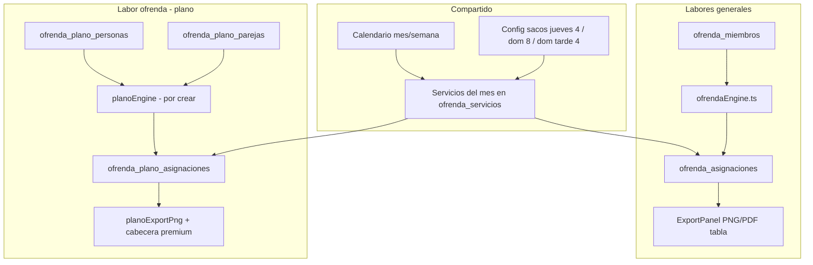

# 02 — Arquitectura: dos labores independientes

## Visión

La página de ofrenda debe albergar **dos módulos** que comparten calendario (mes/semana) y configuración de sacos, pero **no comparten lista de personas**:



## Tablas de datos

### Labores generales

| Tabla | Rol |
|-------|-----|
| `ofrenda_miembros` | Personas G1 (coordinación, vigilancia…) y G2 (colaboradores) |
| `ofrenda_planes` | Un plan por mes/año + punteros secuencia sacos |
| `ofrenda_servicios` | Cada jueves / domingo mañana / domingo tarde |
| `ofrenda_asignaciones` | Miembro × servicio × rol (`realiza`, `vigilancia`, `colaborador_1`…) |

**Roles G1 actuales:** `realiza`, `apoyo`, `vigilancia`, `primera_vez`, `segunda_tercera_vez`, `imposicion_manos`

### Labor ofrenda (plano)

| Tabla | Rol |
|-------|-----|
| `ofrenda_plano_personas` | Directorio de 64 hermanos del plano |
| `ofrenda_plano_parejas` | Matrimonios (16 parejas hoy) |
| `ofrenda_plano_asignaciones` | Persona × servicio × bloque × rol (`ofrendario` \| `apoyo`) |
| `ofrenda_plano_layouts` | Geometría 2D/3D (global, no por mes) |

**Importante:** no hay FK entre `ofrenda_miembros` y `ofrenda_plano_personas`. Es decisión de diseño explícita.

## Relación con servicios del mes

Ambas labores **cuelgan del mismo plan mensual**:

1. Al «Generar Plan» se crean `ofrenda_servicios` (fechas + `dia_tipo`).
2. El motor de labores generales rellena `ofrenda_asignaciones`.
3. El motor de labor ofrenda (nuevo) rellenaría `ofrenda_plano_asignaciones` para los mismos `servicio_id`.

El plano **ya navega** servicios vía `PlanoServiceStrip` leyendo `plan.servicios`.

## Sacos por tipo de día

Cadena existente (`planoTypes.ts`):

```
dia_tipo → sacosParaDia(plan) → resolverModo(4|8) → layout sacos_4 | sacos_8
```

| dia_tipo | Sacos default | Bloques plano | Parejas tarjeta+muñequito |
|----------|---------------|---------------|---------------------------|
| `jueves` | 4 | 4 | 8 (4×2 roles) |
| `domingo` | 8 | 8 | 16 |
| `domingo_tarde` | 4 | 4 | 8 |

Cada bloque necesita **2 personas**: ofrendario + apoyo.

## Punto de acoplamiento actual: rescate al regenerar

`planoRescue.ts` preserva asignaciones del plano cuando se regenera el plan de labores generales. Si añadimos generación automática del plano, habrá que decidir:

- ¿Regenerar labores generales **toca** asignaciones del plano? (hoy se rescatan)
- ¿Botones separados: «Regenerar labores» vs «Regenerar plano»?

→ Ver pregunta P4 en [07-preguntas-abiertas.md](./07-preguntas-abiertas.md).

## Dependencias de implementación

| Componente nuevo | Depende de |
|------------------|------------|
| Turnos en plano personas | Migración BD |
| Género en plano personas | Migración BD o inferencia + seed |
| UI parejas | `ofrenda_plano_parejas` + acciones |
| Motor auto-asignación | Turnos + género + parejas + capacidad |
| Export PNG premium plano | `exportBrand.ts`, `ExportHeaderBlock` |
| Reorganización UX | Ninguna (puede ir primero) |
