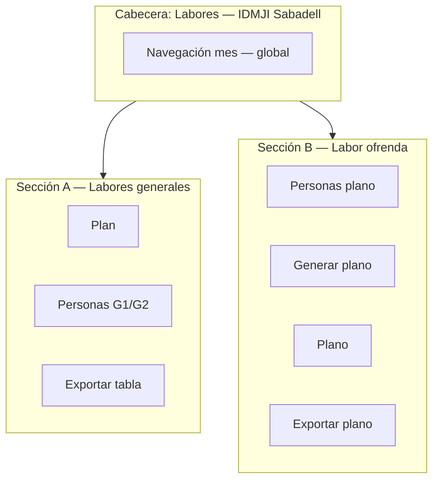

# 03 — Propuesta UX: reorganización visual

## Problema

Cuatro pestañas planas mezclan dos flujos de trabajo sin jerarquía visual.

## Opción recomendada: dos secciones con sub-navegación

Reemplazar las 4 pestañas planas por **2 bloques principales** con color/iconografía distinta:



### Sección A — Labores generales (tono emerald/azul actual)

| Sub-pestaña | Contenido actual | Icono sugerido |
|-------------|------------------|----------------|
| Plan | `PlanTable` + `SacosConfigPanel` + generar | Gift |
| Personas | `MiembrosManager` (solo miembros, quitar sub-toggle) | Users |
| Exportar | `ExportPanel` | Download |

### Sección B — Labor ofrenda (tono distinto: ámbar/dorado o violeta templo)

| Sub-pestaña | Contenido | Icono sugerido |
|-------------|-----------|----------------|
| Personas | `PlanoPersonasManager` ampliado (turnos, parejas) | UsersRound |
| Generar | Nuevo panel: alcance semana/mes + preview + botón generar | Wand2 / Sparkles |
| Plano | `PlanoTab` (sin botón export duplicado) | Map |
| Exportar | Nuevo `PlanoExportPanel` (PNG premium, semana/mes) | ImageDown |

## Alternativa más conservadora (menor diff)

Mantener 4 pestañas pero:

1. **Renombrar** para claridad:
   - `Plan` → «Plan labores»
   - `Exportar` → «Exportar labores»
   - `Plano Ofrenda` → «Plano templo»
2. **Añadir badge** de sección en la barra de tabs (línea divisoria o label «Generales» / «Ofrenda»).
3. **Mover** sub-vista plano de Personas a su propia entrada o dejar solo en sección B.

## Personas — diseño homogéneo

Reutilizar patrones de `MiembrosManager.tsx`:

| Patrón existente (miembros) | Equivalente plano personas |
|-----------------------------|----------------------------|
| Secciones G1 / G2 con leyenda | Secciones Jueves / Dom mañana / Dom tarde |
| `MemberTurnAvailability` toggles | Mismo componente o variante `PlanoTurnAvailability` |
| Tarjeta miembro con acciones | Tarjeta persona con capacidad, turnos, pareja |
| `activo` / deshabilitar | Ya existe en `PlanoPersonasManager` |
| Puesto fijo G1 | No aplica al plano (rotación libre) |

### Tarjeta persona plano (wireframe textual)

```
┌─────────────────────────────────────────────┐
│ María José Vera                    [activo] │
│ Capacidad: [Ofrendario ▾] [Apoyo] [Ambos]   │
│ Turnos: [Jue] [Dom AM] [Dom PM]  (toggles)  │
│ Pareja: Camilo Solorzano  [Cambiar] [Quitar]│
│                              [Editar] [···] │
└─────────────────────────────────────────────┘
```

Sin pareja:

```
│ Pareja: —  [Asignar pareja…]                │
```

## Navegación de mes global

Mover `PlanMonthNavigator` a la **cabecera de página** (visible en todas las sub-pestañas de ambas secciones). El plano y las exportaciones dependen del mes seleccionado.

## Copy i18n propuesto (borrador)

| Clave nueva | ES | CA |
|-------------|----|----|
| `ofrenda.sections.general` | Labores generales | Labors generals |
| `ofrenda.sections.planoLabor` | Labor ofrenda | Labor d'ofrena |
| `ofrenda.tabs.planGeneral` | Plan de labores | Pla de labors |
| `ofrenda.tabs.exportGeneral` | Exportar labores | Exportar labors |
| `ofrenda.tabs.planoPeople` | Personas del plano | Persones del plànol |
| `ofrenda.tabs.generatePlano` | Generar plano | Generar plànol |
| `ofrenda.tabs.exportPlano` | Exportar plano | Exportar plànol |

## Indicadores de estado

Banner contextual cuando falte plan del mes:

- Sección A: «Genera el plan del mes para asignar labores» (ya existe `emptyPlan`)
- Sección B: «Genera el plano de ofrenda para este mes» (nuevo)

## Orden de pestañas recomendado (conservador)

```
[ Labores generales: Plan | Personas | Exportar ]  |  [ Labor ofrenda: Personas | Generar | Plano | Exportar ]
```

Separador visual (`|`) o dos filas en móvil.

## Mobile

En viewport estrecho: **segmented control** de sección (Generales / Ofrenda) arriba, tabs secundarios en scroll horizontal (patrón ya usado en `PlanoServiceStrip`).

## Qué NO cambiar (por ahora)

- Lógica de `ofrendaEngine.ts` para labores generales.
- Geometría del plano (`plano-calibracion-default.json`).
- Export PDF/Share de labores generales.
