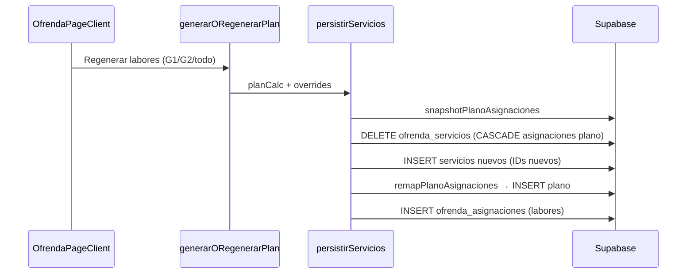

# 09 — QA profundo: regeneración acoplada y exportaciones

## 1. Regeneración labores vs plano (P4)

### Lo que el usuario quiere

- **Labores generales:** generar/regenerar G1/G2 sin tocar asignaciones del plano.
- **Labor ofrenda:** generar/regenerar plano sin tocar `ofrenda_asignaciones`.

### Lo que hace el código hoy



**Archivos:** `actions.ts` (`persistirServicios`, líneas 420–467), `planoRescue.ts`.

### Hallazgos QA

| ID | Hallazgo | Severidad | Detalle |
|----|----------|-----------|---------|
| R-01 | **Acoplamiento oculto** | Alta | Regenerar labores **siempre** borra y recrea servicios. El plano se rescata por `(fecha, dia_tipo, bloque, rol)` — no es independiente del todo. |
| R-02 | **Sin «Regenerar plano»** | Alta | No existe `generarPlanoAsignaciones`. Solo asignación manual o rescate pasivo. |
| R-03 | **`updateSacosConfig` regenera labores** | Media | Cambiar sacos llama `generarORegenerarPlan(..., null)` → regenera **todo** G1+G2 y rescata plano (`actions.ts` ~721). |
| R-04 | **Rescate puede perder filas** | Media | Si cambian fechas del mes (borde caso), `remapPlanoAsignaciones` descarta keys sin match (`planoRescue.test.ts`). |
| R-05 | **Eliminar plan borra plano** | Media | `eliminarPlan` → CASCADE borra servicios y **todas** las asignaciones del plano del mes. |
| R-06 | **Overrides solo labores** | Info | `loadOverrides` solo lee `ofrenda_asignaciones.es_override`, no hay equivalente «override plano» persistente al regenerar plano. |

### Cambios necesarios para P4

1. **Nuevo action** `generarORegenerarPlanoLabor(anio, mes, alcance, modo)` que solo toque `ofrenda_plano_asignaciones`.
2. **Opción en regenerar labores:** checkbox «Mantener plano del templo» (default true) o dejar de borrar servicios (más invasivo).
3. **Desacoplar sacos:** `updateSacosConfig` debería actualizar columnas sin regenerar labores, o pedir confirmación explícita.
4. **UI separada:** botón «Regenerar plano» solo en sección Labor ofrenda; «Regenerar labores» solo en sección general.

### Regla P2 en motor futuro

Al generar o asignar manualmente, validar:

```typescript
// Por servicio_id: persona_id único en todas las filas ofrenda_plano_asignaciones
```

**Hoy:** `savePlanoAsignacion` **no valida** duplicados — un editor puede asignar la misma persona en dos bloques del mismo servicio.

| ID | Hallazgo | Severidad |
|----|----------|-----------|
| R-07 | Sin validación 1 rol/persona/servicio | Media — gap para P2 |

---

## 2. Exportaciones (P7)

### Mapa actual de exports

| Export | Ubicación UI | Renderer | Cabecera | Datos | Prefijo archivo |
|--------|--------------|----------|----------|-------|-----------------|
| Tabla labores PNG | Exportar | `exportCapture` + `ExportLayout` | ✅ `ExportHeaderBlock` | `ofrenda_asignaciones` | `labor-ofrenda-{mes}-{anio}` |
| Tabla labores PDF | Exportar | jsPDF + `drawExportPdfHeader` | ✅ | idem | `.pdf` |
| Plano PNG | Plano → Exportar | `planoExportPng.ts` canvas | ❌ | `ofrenda_plano_asignaciones` | `plano-ofrenda-sabadell-...` |
| Lista labor ofrenda | ❌ No existe | — | — | — | — |

### Hallazgos QA export

| ID | Hallazgo | Severidad | Detalle |
|----|----------|-----------|---------|
| E-01 | **Confusión de nombre «Labor ofrenda»** | Alta | `ExportPanel` ya usa slug `labor-ofrenda-` para la **tabla de labores generales**, no el plano. El usuario quiere «Labor ofrenda» para el **plano**. Hay que renombrar slugs. |
| E-02 | **Plano PNG sin cabecera** | Alta (requisito) | `exportPlanoPng` solo dibuja lienzo 1448×1316 (2D) — sin logo ni gradiente. |
| E-03 | **Cabecera reutilizable** | Info | `ExportHeaderBlock` + `drawExportPdfHeader` + `IDMJI_BRAND` listos para portar a canvas. |
| E-04 | **Un servicio por PNG** | Media | Plano exporta 1 servicio; labores export soporta mes/semana. Falta batch plano. |
| E-05 | **Formato lista** | Alta (nuevo) | Usuario pide toggle PNG plano vs **lista** (tabla bloque/rol/nombre por día). No hay componente — posible variante de `PlanoEditorSheet` tabla o nuevo `PlanoListExport`. |
| E-06 | **Renderer no WYSIWYG** | Baja | Canvas simplifica muñequitos vs `PlanoFigure` SVG — aceptable si se mantiene. |

### Implementación P7 acordada

**Fase A — Cabecera en PNG plano (mínimo viable)**

1. Extender `exportPlanoPng` con bloque superior:
   - Título: **«Labor ofrenda»** (i18n `ofrenda.planoExport.headerTitle`)
   - Subtítulo: fecha + tipo día (jueves / dom mañana / dom tarde)
   - Logo `/logo.jpg` + gradiente `IDMJI_BRAND.headerGradient`
2. Renombrar slug tabla labores → `labores-generales-` o `plan-labores-` para evitar colisión.

**Fase B — Toggle formato**

| Modo | Salida |
|------|--------|
| Plano | PNG actual + cabecera |
| Lista | PNG (o PDF) tabla por servicio: bloque, rol, nombre — estilo premium |

**Fase C — Alcance semana/mes**

- Reutilizar `groupServiciosByWeek` / `ExportScopeControls`.
- Mes: ZIP de PNGs o imagen apilada (decidir tras ver mockup lista).

### Referencia técnica cabecera

Medidas de `ExportHeaderBlock.tsx`:

- Logo 92×92, borde dorado `IDMJI_BRAND.goldGradient`
- Padding ~28px, gradiente navy
- Leyenda chips jueves/dom (opcional en plano)

Portar a canvas en `planoExportPng.ts` antes de `ctx.drawImage(bg, ...)`.

---

## 3. Recomendación UX (P8) tras QA

### Opción elegida: **dos secciones, misma ruta** `/dashboard/ofrenda`

| Criterio | Dos secciones | Dos rutas | Solo renombrar |
|----------|---------------|-----------|----------------|
| Claridad producto | ✅ Alta | ✅ Máxima | ⚠️ Baja |
| Esfuerzo | Medio | Alto (layout, estado mes) | Bajo |
| Comparte plan mensual | ✅ Natural | Requiere contexto compartido | ✅ |
| Mobile | Segmented control | Dos entradas sidebar | Confuso |

**Estructura propuesta:**

```
┌─────────────────────────────────────────────────────────┐
│  Labores — IDMJI Sabadell          ◀ Junio 2026 ▶      │
├─────────────────────────────────────────────────────────┤
│  [ Labores generales ]  |  [ Labor ofrenda ]            │  ← segmento principal
├─────────────────────────────────────────────────────────┤
│  (sub-tabs según sección)                               │
└─────────────────────────────────────────────────────────┘
```

**Labores generales:** Plan · Personas coordinación · Exportar tabla  
**Labor ofrenda:** Personas plano · Generar · Plano · Exportar

**No mover a dos rutas** porque plano y labores comparten `ofrenda_planes` / `ofrenda_servicios` y el mes seleccionado.

---

## 4. Rotación entre meses (P9)

Hoy solo `secuencia_puntero` / `secuencia_puntero_fin` persisten para **sacos numéricos** de labores.

Para plano hace falta:

```sql
-- Propuesta
ALTER TABLE ofrenda_planes
  ADD COLUMN plano_puntero_jueves smallint DEFAULT 1,
  ADD COLUMN plano_puntero_domingo_manana smallint DEFAULT 1,
  ADD COLUMN plano_puntero_domingo_tarde smallint DEFAULT 1;
```

Al cerrar mes: guardar índice de rotación por turno para el siguiente `resolvePunteroInicio` del plano (patrón `resolvePunteroInicio` en `actions.ts`).

---

## 5. Pareja al desactivar (P10)

Flujo en `deletePlanoPersona` o `setPlanoPersonaActivo(false)`:

1. Buscar fila en `ofrenda_plano_parejas` donde `mujer_persona_id` o `hombre_persona_id` = id.
2. `DELETE` pareja.
3. `activo = false` en persona.
4. Opcional: limpiar asignaciones futuras (no histórico).

Hoy `deletePlanoPersona` — verificar si CASCADE en parejas ya borra por FK (mujer/hombre referencian persona con ON DELETE CASCADE → **borrar persona borra pareja**; desactivar no).

| Acción actual | Efecto pareja |
|---------------|---------------|
| Borrar persona | CASCADE elimina pareja ✅ |
| `activo=false` | Pareja **permanece** ❌ — hay que implementar P10 |

---

## 6. Checklist pre-implementación

- [ ] P1 listas turno (imágenes usuario)
- [ ] Mockups P7 (cabecera + lista)
- [ ] Confirmar P5 semana ISO
- [ ] Seed capacidad Edilma + Gleidis
- [ ] Insertar pareja Gleidis–Ramiro
- [ ] Renombrar slug export labores generales
- [ ] Validación 1 persona / servicio en plano
- [ ] Botón regenerar plano separado
- [ ] Puntero rotación plano entre meses
