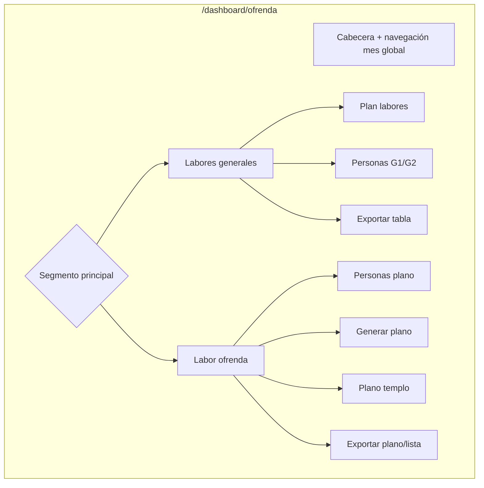
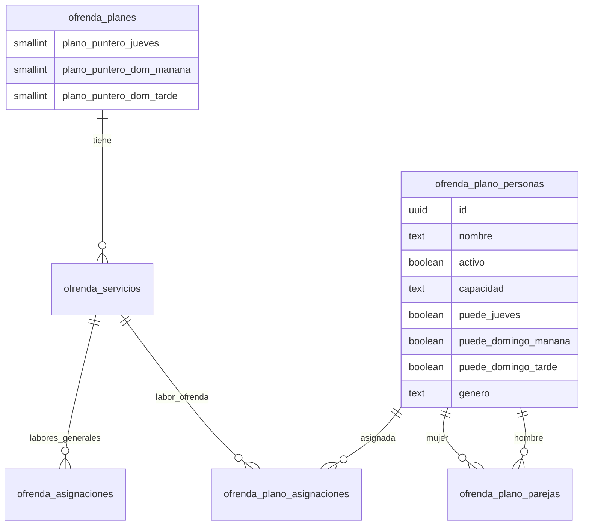
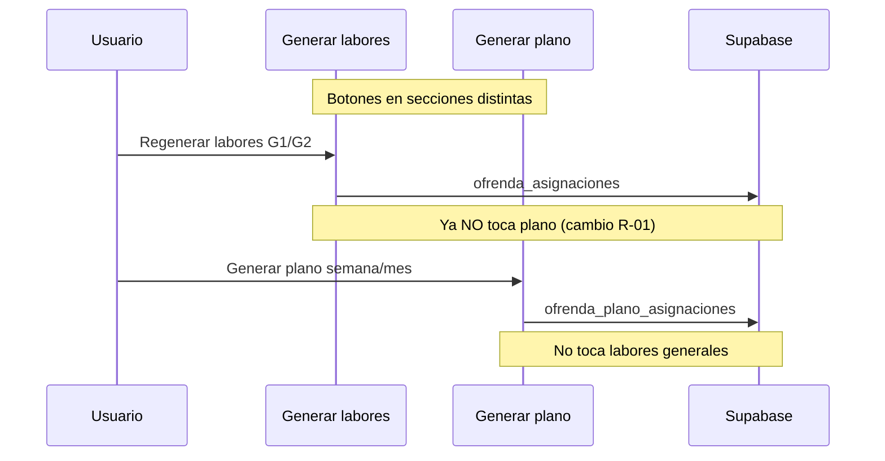
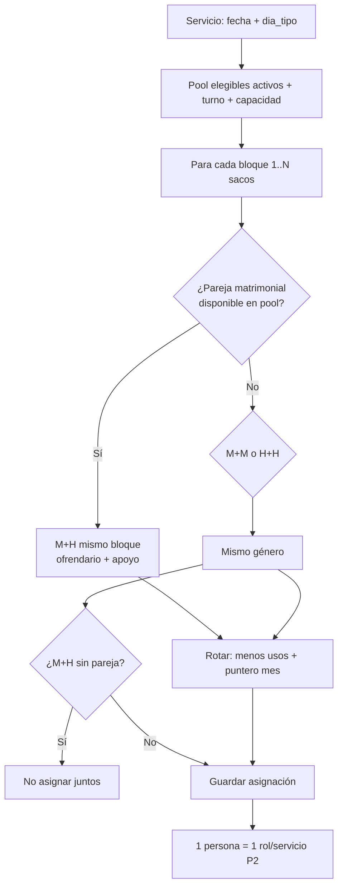
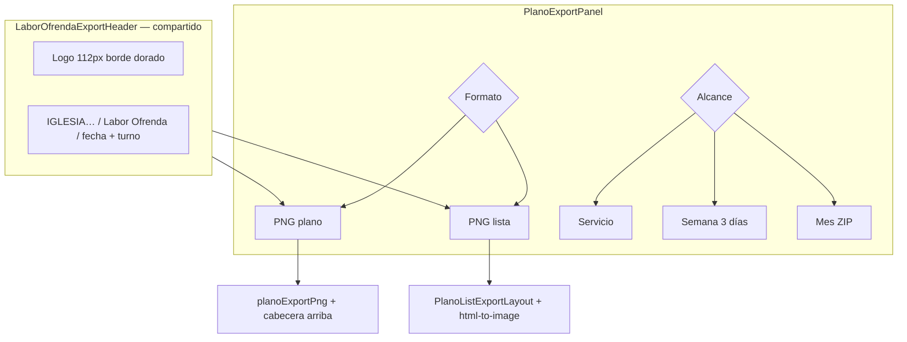
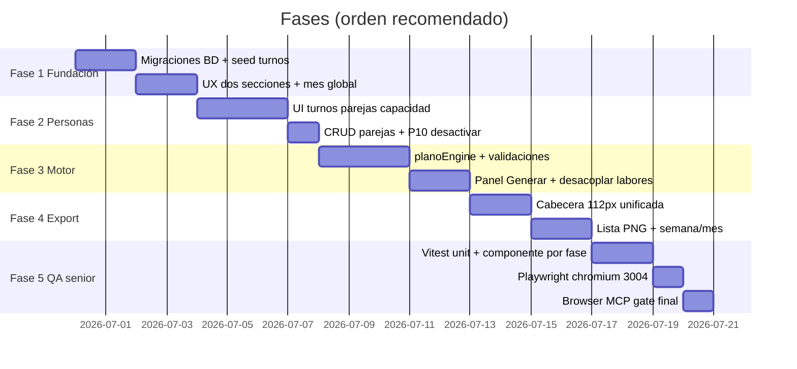

# 12 — Plan de implementación (diseño)

> **Decisión usuario:** las 15 personas sin turno quedan sin asignar por ahora; se asignarán **desde la aplicación** (toggles jueves / dom mañana / dom tarde).
>
> **Cabecera export:** unificada, logo **112px**, misma en plano PNG y lista PNG.

---

## 1. Visión general — qué construimos



**No tocamos** la lógica core de `ofrendaEngine` (vigilancia, colaboradores…). **Ampliamos** el módulo plano con datos, motor, UI y export.

---

## 2. Modelo de datos (Supabase)



### Migraciones (orden)

| # | Archivo | Contenido |
|---|---------|-----------|
| M1 | `ofrenda_plano_turnos.sql` | Columnas `puede_jueves`, `puede_domingo_manana`, `puede_domingo_tarde` (default **false**) |
| M2 | `ofrenda_plano_genero.sql` | Columna `genero` (`mujer` \| `hombre`) + seed 64 nombres |
| M2b | `ofrenda_plano_prioridad_ofrendario.sql` | Columna `prioridad_ofrendario boolean DEFAULT false` (estrella ⭐) |
| M3 | `ofrenda_plano_seed_turnos.sql` | Seed 49 personas con turno; **15 sin ninguno** |
| M4 | `ofrenda_plano_capacidad_fix.sql` | Edilma Moreno + Gleidis → `apoyo`; resto según acordado |
| M5 | `ofrenda_plano_pareja_gleidis_ramiro.sql` | Pareja Gleidis ↔ Ramiro Zapata |
| M6 | `ofrenda_planes_plano_punteros.sql` | Punteros rotación plano entre meses |

### Seed turnos (49 + 15 sin asignar)

```
Jueves ON, resto OFF     → 16 personas (Grupo A)
Dom mañana ON, resto OFF → 21 personas (Grupo B)
Dom tarde ON, resto OFF  → 12 personas (Grupo C)
Los 3 OFF                → 15 personas (asignación manual en app)
```

---

## 3. UI — Personas plano (asignación de turnos desde app)

**Sí, podrás asignarlas tú.** Mismo patrón que `MiembrosManager` + `MemberTurnAvailability`:

```mermaid
flowchart LR
    subgraph tarjeta [Tarjeta persona]
        N[Nombre]
        A[Activo on/off]
        C[Capacidad: ofrendario / apoyo / ambos]
        T[Turnos: Jue | Dom AM | Dom PM]
        P[Pareja: nombre o Asignar]
        ST["⭐ Prioridad ofrendario"]
    end
    
    T --> API[setPlanoPersonaTurnos]
    P --> API2[CRUD ofrenda_plano_parejas]
    A --> API3[activo + romper pareja si off]
```

### Secciones en pantalla Personas (Labor ofrenda)

```
┌─ Sin turno asignado (15) ─────────────────────────┐
│  Alicia Montes    [Jue][DomAM][DomPM]  Pareja: …  │
│  …                                                │
└───────────────────────────────────────────────────┘
┌─ Jueves — Grupo A (16) ───────────────────────────┐
│  …                                                │
└───────────────────────────────────────────────────┘
┌─ Domingo mañana — Grupo B (21) ───────────────────┐
┌─ Domingo tarde — Grupo C (12) ────────────────────┐
```

- Un toggle **activo** enciende ese turno; puedes tener varios ON (como miembros).
- Las 15 empiezan con los tres OFF; tú las mueves cuando quieras.
- Al **desactivar** persona → rompe pareja automáticamente (P10).

---

## 4. Generación — dos botones independientes (P4)



### Motor `planoEngine.ts` (nuevo)



**Reglas confirmadas:**

| Regla | Implementación |
|-------|----------------|
| P2 | Máx. 1 fila por `persona_id` y `servicio_id` |
| Género | M+M, H+H; mixto solo si pareja en BD |
| Capacidad | Gleidis + Edilma Moreno solo apoyo |
| Rotación P9 | Punteros en `ofrenda_planes`, continúan al mes siguiente |
| Pool vacío | Validación pre-generación con mensaje i18n |

---

## 5. Export — cabecera unificada + dos formatos (P7)



| Formato | Contenido |
|---------|-----------|
| **Plano** | Lienzo 2D/3D actual + muñequitos + tarjetas (sin cambiar renderer) |
| **Lista** | Tabla Puesto \| Responsable \| Apoyo + pie dorado |

Semana = 3 PNG o ZIP (jueves + dom AM + dom PM misma semana ISO).

Renombrar export tabla labores: `plan-labores-…` (evitar colisión con `labor-ofrenda-plano-…`).

---

## 6. Fases de implementación



### Fase 1 — Fundación (BD + shell UX)

- Migraciones M1–M6
- `OfrendaPageClient`: segmento **Labores generales | Labor ofrenda** — **[responsive mobile-first](./14-diseno-responsive.md)**
- `PlanMonthNavigator` en cabecera global
- i18n nuevas claves ES/CA
- **QA:** `OfrendaPageClient.sections.test.tsx`, viewport; checklist browser F1

### Fase 2 — Personas plano

- Extender `PlanoPersonasManager` (o `PlanoPersonasManagerV2`)
- Reutilizar `MemberTurnAvailability` → `PlanoTurnAvailability`
- Sección «Sin turno» para las 15
- UI parejas: asignar / cambiar / quitar
- **⭐ prioridad ofrendario** (varias permitidas; desempate rotación)
- Grid responsive tarjetas `md:2` / `xl:3` columnas
- **QA:** `PlanoPersonasManager.*.test.tsx` (turnos, parejas, ⭐, P10); checklist browser F2

### Fase 3 — Motor y generación

- `src/lib/utils/planoEngine.ts` + tests Vitest
- `generarORegenerarPlanoLabor()` en `planoActions.ts`
- Panel **Generar plano** (semana / mes)
- **`PlanoGenerateRulesInfo`** — icono ⓘ con lista de condicionantes ([13-condicionantes-generacion.md](./13-condicionantes-generacion.md))
- `planoGenerateRules.ts` — fuente única reglas UI + motor
- **QA:** `planoEngine.test.ts` (E01–E18), `PlanoGeneratePanel.test.tsx`; checklist browser F3
- **Desacoplar** `persistirServicios`: regenerar labores **no** borra/reinserta plano (o flag explícito)
- Validación 1 persona / servicio en `savePlanoAsignacion`

### Fase 4 — Export

- `LaborOfrendaExportHeader` (React + port canvas)
- `exportPlanoPngPremium()`
- `PlanoListExportLayout` + `PlanoExportPanel`
- Toggle Plano | Lista; alcance servicio / semana / mes

- **QA:** `planoExportPngPremium.test.ts`, `PlanoListExportLayout.export.test.tsx`; checklist browser F4

### Fase 5 — QA

- `npx vitest run` planoEngine, turnos, export
- `npx vitest run src/lib/i18n/`
- `node scripts/check-i18n-hardcoded.mjs`
- Prueba manual puerto 3004

---

## 7. Archivos principales que tocaré

| Área | Archivos |
|------|----------|
| Shell | `OfrendaPageClient.tsx` |
| Personas | `PlanoPersonasManager.tsx`, `planoActions.ts` |
| Motor | `planoEngine.ts` (nuevo), `planoEngine.test.ts` |
| Generar | `PlanoGeneratePanel.tsx` (nuevo) |
| Export | `LaborOfrendaExportHeader.tsx`, `planoExportPng.ts`, `PlanoExportPanel.tsx`, `PlanoListExportLayout.tsx` |
| Labores fix | `actions.ts` (desacoplar rescate) |
| BD | `supabase/migrations/2026…` |
| i18n | `ofrendaKeys.ts`, `translations.ts` |

---

## 8. Lo que NO haré en v1

- Forzar parejas al mismo turno permanente (solo mismo bloque el día del servicio)
- PDF lista (solo PNG salvo que pidas después)
- Dos rutas `/ofrenda` y `/ofrenda/plano` (una página, dos secciones)
- Vincular `ofrenda_miembros` ↔ `ofrenda_plano_personas`

---

### Fase 5 — QA senior + navegador Chromium

Ver **[15-qa-tests-senior.md](./15-qa-tests-senior.md)** y **[E2E_LABOR_OFRENDA_BROWSER.md](./E2E_LABOR_OFRENDA_BROWSER.md)**.

| Bloque | Contenido |
|--------|-----------|
| Vitest | Suite por fase (§3 matriz); `planoEngine` tabla E01–E18 |
| i18n | `translations.parity`, `catalan-quality`, `check-i18n-hardcoded.mjs` |
| Playwright | `e2e/labor-ofrenda-plano.spec.ts` — **chromium**, base URL **3004** |
| **@Browser / MCP** | Recorrido completo §6 — **gate obligatorio** antes de cerrar release |
| Responsive | Proyectos Playwright: desktop + Pixel 5 + iPad; MCP snapshot móvil |

**DoD por fase:** tests verdes + checklist browser de la fase (doc 15 §7).

---

## 9. Criterios de «hecho» (producto + QA)

- [x] Dos secciones visualmente distintas en `/dashboard/ofrenda`
- [x] 49 personas con turno seed; 15 editables desde UI
- [x] Parejas gestionables; Gleidis–Ramiro en BD
- [x] Generar plano semana/mes con reglas género/pareja/capacidad
- [x] Regenerar labores **sin** tocar plano (rescate plano preservado; botones separados)
- [x] Export PNG plano + lista con cabecera 112px homogénea
- [x] i18n ES/CA completo; tests verdes
- [x] **QA senior Fase 5:** Vitest + Playwright chromium + **Browser MCP** ([15-qa-tests-senior.md](./15-qa-tests-senior.md))

---

*Documento de diseño — **implementado 2026-06-30**.*
