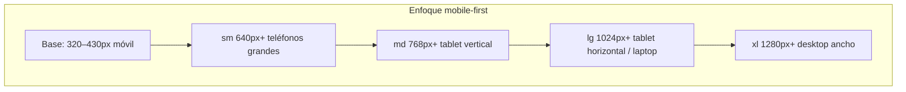

# 14 — Diseño responsive (móvil, tablet, desktop)

> Requisito usuario: **lo más responsive posible** — móviles de distintas marcas/tamaños, tablet y desktop.

Aplica a **toda** la refactorización Labor ofrenda: shell de dos secciones, Personas plano, Generar, Plano, Export.

---

## 1. Estrategia



- **Mobile-first:** estilos base para pantalla estrecha; ampliar con `sm:` / `md:` / `lg:` / `xl:`.
- **Reutilizar** patrones ya probados en `OfrendaPageClient`, `MiembrosManager`, `PlanoTab`, `OfrendaLiquidShell`.
- **Sin anchos fijos** en px salvo lienzo del plano (escala con contenedor).
- **`dvh` / `svh`** para alturas viewport (barra Safari, teclado móvil).
- **`touch-manipulation`** y **mín. 44×44px** en controles táctiles (WCAG).

---

## 2. Breakpoints (Tailwind v4 del proyecto)

| Token | Ancho | Uso principal |
|-------|-------|----------------|
| (default) | &lt; 640px | Móvil: una columna, sheets, tabs scroll |
| `sm:` | ≥ 640px | Móvil grande (iPhone Plus, Android altos) |
| `md:` | ≥ 768px | Tablet vertical |
| `lg:` | ≥ 1024px | Tablet horizontal, laptop |
| `xl:` | ≥ 1280px | Desktop, plano ancho `max-w-7xl` |
| `2xl:` | ≥ 1536px | Monitores grandes (opcional más aire) |

**No** inventar breakpoints custom salvo `@container` en tarjetas densas.

---

## 3. Shell — dos secciones + mes global

### Móvil (&lt; md)

```
┌─────────────────────────────┐
│ ← Labores    ◀ Jun 2026 ▶   │
├─────────────────────────────┤
│ [ Labores gen ] [ Labor ofr ]│  ← segmented full width
├─────────────────────────────┤
│ Plan │ Personas │ …          │  ← scroll horizontal tabs
├─────────────────────────────┤
│         contenido           │
└─────────────────────────────┘
```

- Segmento principal: **2 botones 50/50**, `min-h-[44px]`.
- Sub-tabs: `overflow-x-auto`, `scrollbar-none`, snap opcional.
- Cabecera mes: compacta (`text-base`), subtítulo iglesia `hidden sm:block`.

### Tablet (md–lg)

- Segmento + sub-tabs en **una fila** si cabe; si no, sub-tabs scroll.
- Contenido `max-w-5xl` centrado (labores) o `xl:max-w-7xl` (plano).

### Desktop (xl+)

- Misma estructura; más padding `px-6`.
- Toolbar acciones: `flex-row` alineada a la derecha (patrón actual Plan).

---

## 4. Personas plano (tarjetas + ⭐ + turnos)

| Viewport | Layout |
|----------|--------|
| Móvil | 1 columna; tarjeta apilada: nombre → turnos → capacidad → pareja → ⭐ |
| Tablet | 2 columnas `md:grid-cols-2` en listas por sección |
| Desktop | 2–3 columnas `lg:grid-cols-2 xl:grid-cols-3` según densidad |

**Tarjeta persona (patrón MiembrosManager):**

```
┌──────────────────────────────────────┐
│ Nombre (line-clamp-2 sm:line-clamp-1)│
│ [Jue][DomAM][DomPM]  [⭐]  [···]      │  ← toggles min 40px touch
│ Capacidad · Pareja: …                │
└──────────────────────────────────────┘
```

- Estrella ⭐: botón `min-h-[44px] min-w-[44px]` en móvil.
- Secciones colapsables en móvil (acordeón «Sin turno», «Jueves»…) para reducir scroll.

---

## 5. Generar plano + icono ⓘ

| Viewport | Comportamiento |
|----------|----------------|
| Móvil | Título + ⓘ en fila; ⓘ abre **sheet** (`OfrendaLiquidShell`) con lista condicionantes |
| Tablet+ | ⓘ abre **popover** anclado al botón |

- Botones Generar / Regenerar: `w-full sm:w-auto`, stack vertical en móvil.
- Alcance semana/mes: controles full width en móvil.

---

## 6. Plano templo (lienzo)

Ya usa altura fluida:

```css
min-h-[52dvh] h-[calc(100dvh-18rem)] max-h-[72dvh]
```

| Viewport | Ajuste |
|----------|--------|
| Móvil | `PlanoServiceStrip` scroll horizontal; editor en sheet inferior |
| Tablet | Lienzo + panel lateral opcional `lg:grid-cols-[1fr_320px]` |
| Desktop | Mismo; zoom/pan con gestos + rueda |

- Export: botones en barra fija inferior móvil (`sticky bottom-0 safe-area-pb`).

---

## 7. Export panel (plano + lista)

| Viewport | Layout |
|----------|--------|
| Móvil | Toggle Plano/Lista full width; preview en modal pantalla completa |
| Tablet | Preview al lado si `lg:grid-cols-2` |
| Desktop | Preview amplio + controles izquierda |

Vista previa PNG: `max-w-full h-auto` para no desbordar en pantallas pequeñas.

---

## 8. Safe area y marcas móviles

```css
/* globals o módulo ofrenda */
padding-bottom: env(safe-area-inset-bottom);
padding-left: env(safe-area-inset-left);
padding-right: env(safe-area-inset-right);
```

- Probar mental target: iPhone SE (375), iPhone 14 (390), Pixel (412), Samsung (~360), iPad (768/1024).
- Evitar hover-only: todo accionable también con **tap**.
- `prefers-reduced-motion`: respetar en `framer-motion` (ya usado en ofrenda).

---

## 9. Tipografía fluida (opcional ligero)

Donde título sea largo («Labor ofrenda»):

```css
text-base sm:text-lg lg:text-xl
```

Sin `clamp()` agresivo en v1 — seguir escala Tailwind del repo.

---

## 10. Criterios de aceptación responsive

- [ ] Sin scroll horizontal involuntario en 320px (salvo strips intencionados).
- [ ] Todos los botones ≥ 44px en móvil.
- [ ] Tabs y segmentos usables con pulgar una mano.
- [ ] Plano visible sin recortar controles en `dvh` bajo (iOS Safari).
- [ ] Popover ⓘ → sheet en &lt; md.
- [ ] Tarjetas persona legibles en 360px ancho.
- [ ] Export descargable en móvil Android/iOS.
- [ ] Revisión manual DevTools: 320, 390, 768, 1024, 1280
- [ ] **Playwright chromium** + **cursor-ide-browser (@Browser)** gate — [15-qa-tests-senior.md](./15-qa-tests-senior.md).

---

## 11. Implementación

| Tarea | Dónde |
|-------|--------|
| Segmento dos secciones responsive | `OfrendaPageClient.tsx` |
| Grid tarjetas personas | `PlanoPersonasManager.tsx` |
| Sheet condicionantes | `PlanoGenerateRulesInfo.tsx` |
| Safe area export/plano | `PlanoTab.tsx`, `PlanoExportPanel.tsx` |
| Tests | Opcional: `resize` en tests RTL no prioritario; QA manual checklist arriba |

---

*Incluido en Fase 1–2 del [plan de implementación](./12-plan-implementacion.md).*
