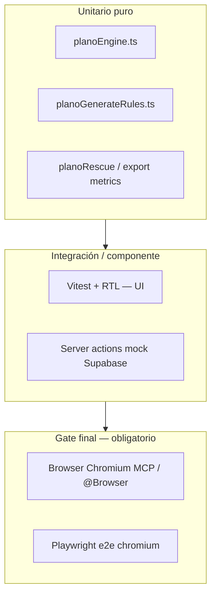

# 15 — QA senior y estrategia de pruebas (todas las fases)

> **Estado:** ✅ Ejecutado 2026-06-30  
> **Requisito:** pruebas **senior** en cada fase + verificación final en **navegador Chromium** (Playwright y/o MCP **cursor-ide-browser** / @Browser).
>
> Puerto dev del proyecto: **`http://localhost:3004`** (no 3000).

---

## 1. Pirámide de pruebas



| Capa | Herramienta | Cuándo |
|------|-------------|--------|
| Unitario | Vitest | Cada PR / cada fase antes de merge |
| Componente | Vitest + Testing Library | Tras cambios UI |
| i18n / calidad CA | `translations.*.test.ts`, `check-i18n-hardcoded.mjs` | Siempre que haya textos |
| E2E | Playwright `--project=chromium` | Fase 5 + regresión |
| Exploratorio visual | **cursor-ide-browser** (MCP) | **Gate final** por fase y release |

---

## 2. Comandos estándar (CI y local)

```bash
# Unit + componente ofrenda
npx vitest run src/app/dashboard/ofrenda/ src/lib/utils/planoEngine.test.ts

# i18n
npx vitest run src/lib/i18n/
node scripts/check-i18n-hardcoded.mjs

# Typecheck
npx tsc --noEmit

# E2E Chromium (servidor en 3004)
$env:PLAYWRIGHT_BASE_URL="http://localhost:3004"
npx playwright test e2e/labor-ofrenda-plano.spec.ts --project=chromium

# Build producción
npm run build
```

**Nota:** actualizar `playwright.config.ts` o siempre exportar `PLAYWRIGHT_BASE_URL=http://localhost:3004` al correr e2e locales.

---

## 3. Matriz QA por fase

### Fase 1 — Fundación (BD + shell UX)

| Tipo | Archivo / acción | Casos senior |
|------|------------------|--------------|
| **Migración** | SQL idempotente | Re-ejecutar migración sin error; seed 49+15 turnos |
| **Unit** | `planoPersonaTurnos.test.ts` (nuevo) | `puedeEnTurno()` por `dia_tipo` |
| **Componente** | `OfrendaPageClient.sections.test.tsx` (nuevo) | Segmento Labores/Labor ofrenda; mes global visible en todas las sub-tabs |
| **Responsive** | `ofrendaViewport.test.ts` (extender) | Breakpoints 320/768/1280 — clases críticas presentes |
| **i18n** | Paridad claves `ofrenda.sections.*`, `ofrenda.tabs.*` | ES/CA no vacío |
| **Browser** | Checklist F1 abajo | Navegar segmentos; cambiar mes desde Labor ofrenda |

### Fase 2 — Personas plano (turnos, parejas, ⭐)

| Tipo | Archivo | Casos senior |
|------|---------|--------------|
| **Componente** | `PlanoPersonasManager.turns.test.tsx` | Toggle turno persiste; sección «Sin turno» |
| **Componente** | `PlanoPersonasManager.parejas.test.tsx` | Crear/cambiar/quitar pareja; Gleidis–Ramiro |
| **Componente** | `PlanoPersonasManager.star.test.tsx` | ⭐ on/off; varias estrellas; solo apoyo no puede ⭐ ofrendario |
| **Componente** | `PlanoPersonasManager.deactivate.test.tsx` | P10: desactivar rompe pareja |
| **Unit** | `planoParejasValidation.test.ts` | Unicidad mujer/hombre; no auto-pareja |
| **a11y** | RTL | `aria-label` en ⭐ y turnos; touch 44px (`toHaveClass` min-h) |
| **Browser** | Checklist F2 | Asignar turno a 1 de las 15; crear pareja en UI |

### Fase 3 — Motor + Generar plano

| Tipo | Archivo | Casos senior |
|------|---------|--------------|
| **Unit** | `planoEngine.test.ts` | **Tabla exhaustiva** (ver §4) |
| **Unit** | `planoGenerateRules.test.ts` | IDs reglas ↔ claves i18n 1:1 |
| **Componente** | `PlanoGeneratePanel.test.tsx` | ⓘ abre lista; generar semana/mes disabled sin plan |
| **Componente** | `PlanoGenerateRulesInfo.test.tsx` | Popover desktop / sheet móvil (`matchMedia` mock) |
| **Integración** | `generarPlanoAsignaciones.integration.test.ts` | Mock Supabase: inserta N filas; no duplica persona/servicio |
| **Regresión** | `planoRescue.test.ts` + nuevo | Regenerar **labores** no borra plano (post-desacople) |
| **Catálogo QA** | `planoNotifications.qa.test.ts` | Inventario toasts generar/error (patrón `ofrendaNotifications.qa.test.ts`) |
| **Browser** | Checklist F3 | Generar semana; verificar nombres en Plano; ⓘ legible |

### Fase 4 — Export PNG premium

| Tipo | Archivo | Casos senior |
|------|---------|--------------|
| **Unit** | `laborOfrendaExportHeader.test.ts` | Métricas logo 112px; textos interpolados |
| **Unit** | `planoExportPngPremium.test.ts` | Canvas height = header + lienzo (mock canvas) |
| **Componente** | `PlanoExportPanel.test.tsx` | Toggle Plano/Lista; alcance semana |
| **Componente** | `PlanoListExportLayout.export.test.tsx` | Columnas Puesto/Responsable/Apoyo; cabecera homogénea |
| **Regresión** | `ExportLayout.export.test.tsx` | Slug labores renombrado; no colisión nombres archivo |
| **Browser** | Checklist F4 | Descargar PNG plano + lista; abrir imagen; cabecera visible |

### Fase 5 — Gate release (obligatorio)

| Paso | Comando / herramienta |
|------|----------------------|
| 1 | `npx vitest run` (suite completa) |
| 2 | `node scripts/check-i18n-hardcoded.mjs` |
| 3 | `npx tsc --noEmit` |
| 4 | `npm run build` |
| 5 | `npx playwright test e2e/labor-ofrenda*.spec.ts --project=chromium` |
| 6 | **Browser MCP** — recorrido completo §6 |
| 7 | Capturas 320 / 768 / 1280 guardadas en `docs/ofrenda-labor-ofrenda/qa-screenshots/` (opcional) |

---

## 4. Tabla de casos — `planoEngine` (senior)

Cada fila = un `it()` o `it.each()`:

| # | Escenario | Entrada | Esperado |
|---|-----------|---------|----------|
| E01 | Pareja M+F en pool | Ramiro + Gleidis | Ramiro ofrendario, Gleidis apoyo |
| E02 | M+M sin estrella | 2 hombres | Rotación decide ofrendario |
| E03 | M+M una ⭐ | H1⭐ + H2 | H1 ofrendario |
| E04 | M+M dos ⭐ | H1⭐ + H2⭐ | Desempate rotación |
| E05 | F+F una ⭐ | M1⭐ + M2 | M1 ofrendario |
| E06 | M+F sin pareja BD | — | No mismo bloque |
| E07 | Solo apoyo en rol | Gleidis | Nunca ofrendario |
| E08 | 1 persona 2 bloques mismo servicio | — | Rechazado (P2) |
| E09 | Turno incorrecto | persona solo dom AM en jueves | Excluida |
| E10 | Sin turno (3 flags false) | — | Excluida |
| E11 | Inactivo | activo=false | Excluida |
| E12 | 4 sacos jueves | — | 8 asignaciones |
| E13 | 8 sacos domingo | — | 16 asignaciones |
| E14 | Rotación mes N→N+1 | punteros | Continuidad P9 |
| E15 | Pareja solo uno en pool | — | Otro bloque M+M o H+H |
| E16 | Capacidad ofrendario | solo apoyo | Solo rol apoyo |
| E17 | Pre-check pool insuficiente | 3 personas, 4 sacos | Error validación |
| E18 | Regenerar rellenar huecos | modo rellenar | No sobrescribe manual |

**Técnica senior:** motor **puro** sin Supabase; fixtures en `planoEngine.fixtures.ts`; property-style con `fast-check` solo si aporta (opcional).

---

## 5. Patrones senior del repo (seguir)

| Patrón | Ejemplo existente | Aplicar en |
|--------|-------------------|------------|
| Catálogo notificaciones | `ofrendaNotifications.qa.test.ts` | `planoNotifications.qa.test.ts` |
| `data-testid` estable | `ofrenda-miembro-fijo-*` | `ofrenda-plano-star-*`, `ofrenda-section-labor-ofrenda` |
| Export layout snapshot | `ExportLayout.export.test.tsx` | `PlanoListExportLayout` |
| Liquid shell a11y | `OfrendaLiquidShell.test.tsx` | `PlanoGenerateRulesInfo` móvil |
| Viewport helpers | `ofrendaViewport.test.ts` | Shell dos secciones |

---

## 6. Gate final — Navegador Chromium (@Browser / MCP)

**Herramientas (en orden de preferencia implementación):**

1. **cursor-ide-browser** (MCP) — QA exploratorio + capturas durante desarrollo.
2. **Playwright chromium** — e2e repetible en CI.

**URL base:** `http://localhost:3004/dashboard/ofrenda`

### Precondiciones

```bash
npm run dev   # puerto 3004
# Usuario EDITOR o ADMIN logueado
```

### Script MCP (agente / manual)

Documentar en `docs/ofrenda-labor-ofrenda/E2E_LABOR_OFRENDA_BROWSER.md`:

| Paso | Acción MCP | Verificación |
|------|------------|--------------|
| 1 | `browser_navigate` → `/dashboard/ofrenda` | Página carga |
| 2 | `browser_snapshot` | Segmento Labores generales \| Labor ofrenda |
| 3 | Clic Labor ofrenda → Personas | Secciones turno; ⭐ visible |
| 4 | Activar turno a persona «sin turno» | Toast éxito |
| 5 | Generar → ⓘ | Lista condicionantes (pareja H ofrendario, ⭐, etc.) |
| 6 | Generar plano semana | Toast éxito |
| 7 | Plano → servicio domingo | Nombres en tarjetas |
| 8 | Export → PNG plano | Descarga; `browser_take_screenshot` |
| 9 | Export → PNG lista | Tabla 8 filas domingo mañana |
| 10 | Cambiar idioma CA | Textos catalanes normativos |
| 11 | Resize / emular móvil | Tabs scroll; sheet ⓘ |

### Viewports Playwright (proyectos)

```typescript
// e2e/labor-ofrenda-plano.spec.ts — proyectos sugeridos
{ name: 'chromium-desktop', use: { ...devices['Desktop Chrome'] } },
{ name: 'chromium-mobile', use: { ...devices['Pixel 5'] } },
{ name: 'chromium-tablet', use: { ...devices['iPad (gen 7)'] } },
```

Ejecutar gate:

```bash
PLAYWRIGHT_BASE_URL=http://localhost:3004 npx playwright test e2e/labor-ofrenda-plano.spec.ts
```

### Criterio de paso browser

- [ ] Sin errores consola críticos (`browser_console_messages`)
- [ ] Sin regresión visual grave en capturas
- [ ] Flujos F1–F4 completados en **desktop + móvil** (MCP o Playwright)
- [ ] PNG descargado abre con cabecera «Labor ofrenda»

---

## 7. Checklists browser por fase (resumen)

### F1 — Shell
- [ ] Segmento cambia sección sin perder mes
- [ ] Mes navegable desde Labor ofrenda
- [ ] 320px: sin overflow roto

### F2 — Personas
- [ ] ⭐ toggle
- [ ] Pareja Gleidis–Ramiro
- [ ] Desactivar rompe pareja

### F3 — Generar
- [ ] ⓘ condicionantes completas
- [ ] Generar semana rellena plano
- [ ] Regenerar labores no vacía plano

### F4 — Export
- [ ] PNG plano + lista con cabecera 112px
- [ ] Semana 3 servicios

### F5 — Release
- [ ] Vitest + build + Playwright chromium + **recorrido MCP completo §6**

---

## 8. Definición de hecho (DoD) con QA

Ninguna fase se considera **terminada** sin:

1. Tests unitarios/componente de la fase en verde.
2. i18n ES/CA si hay copy nuevo.
3. Checklist browser de la fase (MCP o Playwright).
4. Sin `test.only` / `describe.skip` sin issue.

---

*Referenciado desde [12-plan-implementacion.md](./12-plan-implementacion.md) Fase 5.*
