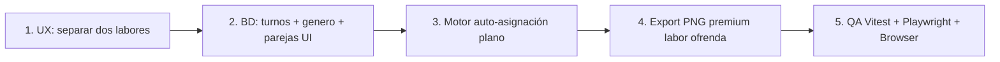

# Labor Ofrenda — Análisis QA y hoja de ruta

> **Fecha:** 2026-06-29 · **Implementado:** 2026-06-30  
> **Rama base:** `desarrollo`  
> **Estado:** ✅ **Implementación v1 completada** (dos secciones, motor, export, QA)

## Qué hay en esta carpeta

| Documento | Contenido | Estado |
|-----------|-----------|--------|
| [01-qa-estado-actual.md](./01-qa-estado-actual.md) | Inventario QA de la página `/dashboard/ofrenda` hoy | ✅ Referencia |
| [02-arquitectura-dos-labores.md](./02-arquitectura-dos-labores.md) | Dos dominios de datos, flujos y dependencias | ✅ Implementado |
| [03-ux-reorganizacion.md](./03-ux-reorganizacion.md) | Propuesta de navegación, agrupación visual y copy | ✅ Implementado |
| [04-personas-turnos-parejas.md](./04-personas-turnos-parejas.md) | Modelo de datos: 64 personas, 3 turnos, parejas, género | ✅ Implementado |
| [05-motor-auto-asignacion.md](./05-motor-auto-asignacion.md) | Especificación del generador semanal/mensual del plano | ✅ Implementado |
| [06-exportacion-png-labor-ofrenda.md](./06-exportacion-png-labor-ofrenda.md) | Nueva exportación PNG con cabecera premium | ✅ Implementado |
| [07-preguntas-abiertas.md](./07-preguntas-abiertas.md) | Dudas pendientes (P1, P5, mockups) | ✅ Resuelto → [08](./08-respuestas-usuario.md) |
| [08-respuestas-usuario.md](./08-respuestas-usuario.md) | Respuestas confirmadas P2–P10 | ✅ Confirmado |
| [09-qa-regeneracion-y-export.md](./09-qa-regeneracion-y-export.md) | QA profundo regeneración acoplada y exports | ✅ Revisado |
| [10-especificacion-export-labor-ofrenda.md](./10-especificacion-export-labor-ofrenda.md) | Spec PNG plano + lista (mockups + cabecera homogénea) | ✅ Implementado |
| [11-turnos-p1-grupos.md](./11-turnos-p1-grupos.md) | P1: listas jueves / dom AM / dom PM + sin turno | ✅ Seed + UI |
| [12-plan-implementacion.md](./12-plan-implementacion.md) | **Plan de diseño e implementación** (esquemas, fases) | ✅ Completado |
| [13-condicionantes-generacion.md](./13-condicionantes-generacion.md) | Reglas del motor + icono ⓘ en Generar plano | ✅ Implementado |
| [14-diseno-responsive.md](./14-diseno-responsive.md) | Responsive móvil / tablet / desktop | ✅ Implementado |
| [15-qa-tests-senior.md](./15-qa-tests-senior.md) | **QA senior** — tests por fase + Chromium | ✅ Ejecutado |
| [E2E_LABOR_OFRENDA_BROWSER.md](./E2E_LABOR_OFRENDA_BROWSER.md) | Gate final @Browser / MCP puerto 3004 | ✅ Verificado |

## Resumen ejecutivo

Hoy la página mezcla **dos productos distintos** bajo el mismo título «Labores»:

1. **Labores generales** — plan mensual de `ofrenda_miembros` (G1/G2): coordinador, apoyo, vigilancia, colaboradores, imposición de manos… Con generación automática, turnos y export PNG/PDF de tabla.
2. **Labor ofrenda (plano)** — directorio de `ofrenda_plano_personas` (64 personas), asignación manual en el lienzo del templo, export PNG del plano **sin cabecera premium**.

Lo que falta para la visión del usuario:

- Diferenciación visual clara entre ambos mundos.
- **3 pools de personas** por turno (jueves / domingo mañana / domingo tarde) — **no existen en BD ni en UI**.
- **Generación automática** del plano con rotación y reglas de género/pareja — **no implementada** (parejas solo en BD).
- **Export PNG labor ofrenda** con cabecera logo + colores premium — **reutilizar** `ExportHeaderBlock` / `exportBrand.ts`.
- **Gestión de parejas** y turnos en UI homogénea con `MiembrosManager`.

## Estado en Supabase (verificado)

| Elemento | Estado |
|----------|--------|
| `ofrenda_plano_personas` | 64 activas, turnos + género + ⭐ |
| `ofrenda_plano_parejas` | 17 parejas (incl. Gleidis–Ramiro) |
| Turnos en plano personas | ✅ `puede_jueves`, `puede_domingo_manana`, `puede_domingo_tarde` |
| `genero` en plano personas | ✅ Columna + seed |
| Punteros rotación plano | ✅ `plano_puntero_*` en `ofrenda_planes` |

## Orden de implementación — completado

## Próximo paso

Mantenimiento y mejoras v2 (export semana/mes ZIP, PDF lista) si se solicitan.
